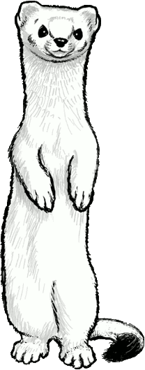
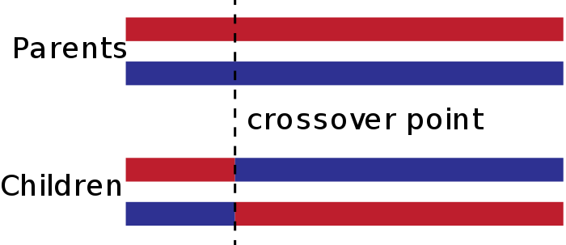

 *This work is licensed under a [Creative Commons Attribution-ShareAlike 4.0 International License](http://creativecommons.org/licenses/by-sa/4.0/)*

---

**TL;DR**
Writing a GAs system from scratch is a great learning experience but for real tasks don't reinvent the wheel. It's not just a matter of subtleties: issues in a fresh implementation can easily go unnoticed because GAs are fault-tolerant by their very nature... at the expense of performance.

---



The article is inspired by a question asked on StackOverflow.

A user was trying to understand how to implement a genetic algorithm for string guessing.

Specifically the program attempted to guess a secret phrase (I'm sorry, not [`"Methinks it is like a weasel"`](https://en.wikipedia.org/wiki/Weasel_program), just `"Hello world"`) by evolving a random set of initial guesses.

The task is a good way to introduce oneself to GAs since a solution doesn't require too much code. This is not to say it's a trivial task: many details are interesting and there are several error-prone choices.

The code didn't work because of:

- minor overlooks (Python indentation, missing function calls);
- some GAs specific issues.

Debugging the GAs-specific issues is a great learning experience.

## Crossover operator

```python
target = "Hello World"
RAND_NUM = random.random()
CROSSOVER_RATE = 0.7

def crossover(parentA, parentB):
    if RAND_NUM < CROSSOVER_RATE:
        random_index = random.randint(0, len(target))
        parentASlice = parentA[:random_index]
        parentBSlice = parentB[random_index:]

        return (parentASlice + parentBSlice), (parentBSlice + parentASlice)
    return parentA, parentB
```

It's a standard *single-point crossover*: a single crossover point on both parents' strings is selected and all data beyond that point in either organism string is swapped between the two parent organisms. The resulting organisms are the children:



Does the description match the code? Only partially.

**The first child is correctly generated but the second one is reversed**:


It works but in a less than optimal manner: [schemata](https://en.wikipedia.org/wiki/Schema_(genetic_algorithms)) in the second child are completely messed.

Also:

- `randint(0, len(target))` returns a random integer `N` such that `0 <= N <= len(target)` and when `random_index == len(target)` the `crossover` functions returns two copies of the first parent;
- `RAND_NUM` is generated "once and for all" so an instance of the program will work in a binary way: always / never performing crossover.

A possible implementation follows:

```python
def crossover(parent1, parent2):
    i = random.randint(1, len(target) - 1)
    return parent1[:i] + parent2[i:], parent2[:i] + parent1[i:]
```

Performing / avoiding the crossover should not be a [concern](https://en.wikipedia.org/wiki/Separation_of_concerns) of `crossover` and the decision has been delegated to the calling function.

## Mutation

```python
GENESET = " abcdefghijklmnopqrstuvwxyzABCDEFGHIJKLMNOPQRSTUVWXYZ!"
MUTATION_RATE = 0.01
POP_SIZE = 300

def mutate(parent):
    gene_index_to_mutate = random.randint(0, len(parent) - 1)
    mutation_value = random.choice(GENESET)
    genes = list(parent)
    genes[gene_index_to_mutate] = mutation_value
    return ''.join(genes)

def generateNewPopulation(population):
    newPopulation = dict()

    while(len(newPopulation) <= POP_SIZE):
        child_one = chooseChild(population)
        child_two = chooseChild(population)
        child_one, child_two = crossover(child_one, child_two)
        child_one = mutate(child_one)
        child_two = mutate(child_two)

    # ...
```

Here we have a `MUTATION_RATE` parameter that is never used. Mutation always happens and it's probably too much.

Usually (it's not mandatory) a [mutation operator](https://en.wikipedia.org/wiki/Mutation_(genetic_algorithm)) involves a probability that an arbitrary bit in a genetic sequence will be changed from its original state. A common method of implementing the mutation operator involves generating a random variable for each bit in a sequence. This random variable tells whether or not a particular bit will be modified. This mutation procedure, based on the biological *point mutation*, is called *single point mutation*.

## Initial population

```python
def generateBasePopulation():
    population = dict()

    for _ in range(POP_SIZE):
        gene = generateParent(len(target))
        population[gene] = 0

    return population
```

The population is contained in a Python dictionary (the `key` is the individual / chromosome and the `value` is the fitness). This decision implies that there aren't duplicated individuals. It's not a usual design but helps to ensure that the solution space  is adequately searched, especially in the earlier stages of the optimization process (see 
[An Overview of methods maintaining Diversity in Genetic Algorithms](http://citeseerx.ist.psu.edu/viewdoc/download?doi=10.1.1.413.7546&rep=rep1&type=pdf), Deepti Gupta, Shabina Ghafir, 2012).

Here the problem regards the size of the population: it's often less than `POP_SIZE`. A fixed version of the function follows:

```python
def generate_base_population(size):
    population = dict()
    target_size = len(target)

    while len(population) < size:
        population[random_individual(target_size)] = -1  # unknown fitness

    return population
```

The fitness of an individual is in the `[0; len(target)]` range. Using `-1` (instead of `0`) allows to identify unscored individuals (and more advanced implementation based on lazy-evaluation).

## Roulette-wheel selection (fitness proportionate selection)

```python
def chooseChild(population):
    fitnessSum = sum(population.values())
    pick = random.uniform(0, fitnessSum)
    current = 0
    for pop in population:
        current += population[pop]
        if current >= pick:
            return pop

def generateNewPopulation(population):
    newPopulation = dict()

    while(len(newPopulation) <= POP_SIZE):
        child_one = chooseChild(population)
        child_two = chooseChild(population)
        # ...
```

The algorithm has a `O(n)` complexity. Having to pick many values with the same set of weights, we could also turn this solution into a `O(log(n))` solution by using a binary search, or even an `O(1)` solution by using some kind of look-up table (see  [Wikipedia - Fitness Proportionate Selection](https://en.wikipedia.org/wiki/Fitness_proportionate_selection)).

## Alternative selection method

Initially only part of the issues had been identified: the calls to the selection function (`chooseChild`) were completely missing and this seemed the main problem.

A selection procedure was suggested ([tournament selection](https://en.wikipedia.org/wiki/Tournament_selection)):

```python
def tournament_child(population, pressure = 4):
    participants = random.sample(population.keys(), pressure)
    return max(participants, key = lambda k: population[k])
```

and the missing calls inserted into the `generateNewPopulation` function. Everything started to work and everyone was happy.

Indeed it was just a half solution: playing with the code you can easily determine that **a correct implementation is at least an order of magnitute faster**.

It's the *double nature* of genetic algorithms: if there is a way to crash your code they will find it and, at the same time, they will bypass implementation errors as much as they can (at the expense of performance).

## Notes

The complete Python program is available [here](https://github.com/morinim/documents/blob/master/ga_string_guess/ga.py).

An efficient implementantion using the [Vita framework](https://github.com/morinim/vita/) is described [here](https://github.com/morinim/vita/wiki/string_guessing_tutorial).
