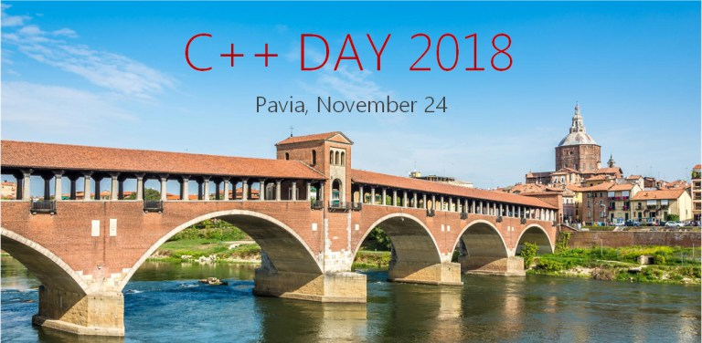

# C++ Day 2018
24 novembre @ 8:30 AM - 6:00 PM

The C++ Day is a fall event dedicated to C++ development where professionals, students and companies meet and share experience.

time 	duration 	room 102 	room 103
08.30 - 09.30 	60' 	Check-in
09.30 - 09.45 	15' 	Welcome Message
Marco Arena
Riccardo Brugo
Federico Pasqua
9.45 - 11.15 	90' 	Keynote
HPX : High performance computing in C++ with concurrency parallelism and futures
(ENG)
John Biddiscombe 	-
11.15 - 11.45 	30' 	Break
11.45 - 12.35 	50' 	Unconvex Nesting Optimization
(ENG)
Fabrizio Radaelli 	A.I. dalla teoria alla pratica
(ITA)
Sebastiano Galazzo
12.35 - 14.05 	90' 	Lunch Break
14.05 - 14.25 	20' 	Exploring IoT with RTI DDS Connext
(ENG)
Giorgio Zoppi 	Unevaluated operands: the SFINAE you don't expect
(ITA)
Michele Caini
14.30 - 15.20 	50' 	Building a scientific C++ library as front-end of a Fortran library
(ENG)
Alfio Lazzaro 	Lessons Learned Developing Evolutionary Algorithms in C++
(ITA)
Manlio Morini
15.20 - 15.50 	30' 	Break
15.50 - 16.40 	50' 	Macro free non intrusive runtime reflection system in C++
(ENG)
Michele Caini 	Il punto su C++20
(ITA)
Alberto Barbati
16.45 - 17.35 	50' 	Cython: Importare il C++ in Python velocemente
(ITA)
Federico Pasqua 	GIS in C++
(ITA)
Alberto Bignotti
17.35 - 18.00 	25' 	Closing Message
Marco Arena
Riccardo Brugo
Federico Pasqua