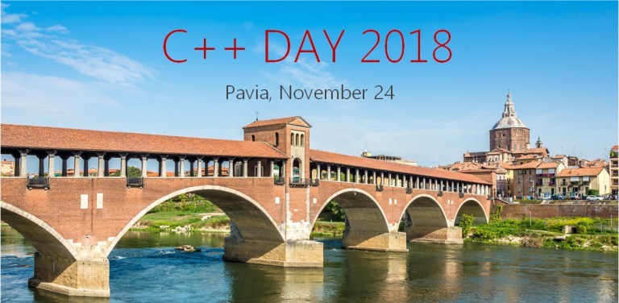

# Lessons Learned developing evolutionary algorithms in C++

Evolutionary optimisation frameworks offer significant ‘off-the-shelf’ optimisation capabilities.
Many C++ libraries enjoy on-going development and increasing maturity and they can be attractive options for programmers.

This talk describes some key aspects to make an informed choice:

- evolutionary algorithms (EAs) and the AI / ML landscape;
- how do they work;
- (sub-)varieties of EAs;
- when to prefer other approaches;
- coding examples;
- survey of available C++ frameworks.

It also deals with C++ techniques adopted in our open source Genetic Programming framework (Vita) regarding:

- PRNG;
- hashing;
- small vector optimization.

**NOTE**: part of the [Vita](https://github.com/morinim/vita)-related code is outdated. An up to date version of the 8-Queens example is available [here](https://github.com/morinim/vita/wiki/8queens_tutorial).

## C++ Day 2018
24 novembre @ 8:30 AM - 6:00 PM

The C++ Day is a fall event dedicated to C++ development where professionals, students and companies meet and share experience.

time          | duration |        room 102 | room 103
--------------|----------|-----------------|---------
08.30 - 09.30 |      60' | Check-in        |
09.30 - 09.45 |      15' | Welcome Message (Marco Arena, Riccardo Brugo, Federico Pasqua) |
9.45 - 11.15  |      90' | Keynote **HPX: High performance computing in C++ with concurrency parallelism and futures** (John Biddiscombe) |
11.15 - 11.45 |      30' | Break           | Break
11.45 - 12.35 |      50' | **Unconvex Nesting Optimization** (Fabrizio Radaelli) | **A.I. dalla teoria alla pratica** (Sebastiano Galazzo)
12.35 - 14.05 |      90' | Lunch Break     | Lunch Break
14.05 - 14.25 |      20' | **Exploring IoT with RTI DDS Connext** (Giorgio Zoppi) | **Unevaluated operands: the SFINAE you don't expect** (Michele Caini)
14.30 - 15.20 |      50' | **Building a scientific C++ library as front-end of a Fortran library** (Alfio Lazzaro) | **Lessons Learned Developing Evolutionary Algorithms in C++** (Manlio Morini)
15.20 - 15.50 |      30' | Break           | Break
15.50 - 16.40 |      50' | **Macro free non intrusive runtime reflection system in C++** (Michele Caini) | **Il punto su C++20** (Alberto Barbati)
16.45 - 17.35 |      50' | **Cython: Importare il C++ in Python velocemente** (Federico Pasqua) | **GIS in C++** (Alberto Bignotti)
17.35 - 18.00 |      25' | Closing Message (Marco Arena, Riccardo Brugo, Federico Pasqua) |

### Keywords

AI, C++20, Fortran, GIS, hpx, IoT, Optimization, Reflection, SFINAE

### Luogo

 Dipartimento di Fisica – Università degli Studi di Pavia - [Via Bassi, 6 - Pavia, Italia](https://www.google.com/maps/place/Via+Agostino+Bassi,+6,+27100+Pavia+PV/@45.1977251,9.1409387,17z/data=!3m1!4b1!4m5!3m4!1s0x478727003f1fe2af:0x45860f1770200436!8m2!3d45.1977251!4d9.1431274?hl=en)

### Organizzatore
[Italian C++ Community ](http://www.italiancpp.org/)

### Riferimenti

https://www.italiancpp.org/event/cppday18/
