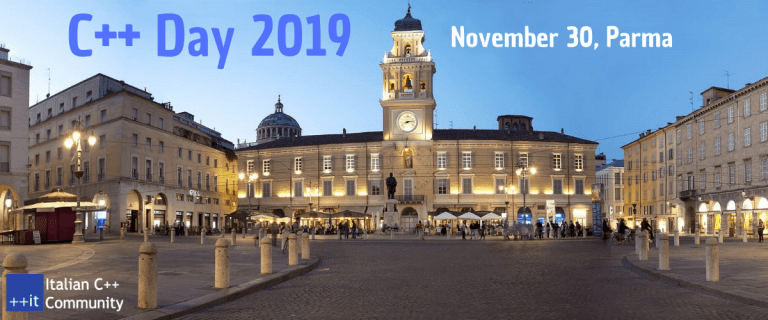

# An introduction to Monte Carlo Tree Search

Monte Carlo Tree Search is one of the machine learning techniques at the heart of AlphaGo/Zero, the first computer program to beat the world champion in a game of Go.

It’s elegant and easy to understand, can be used with little or no domain knowledge, and has succeeded on difficult problems (not only in the game area).

As we describe the algorithm, we will write a basic C++ implementation.

## C++ Day 2019
30 novembre @ 9:00 AM - 6:00 PM

The C++ Day is a not-for-profit Italian event about C++ development where professionals, companies and students meet and share experience. The event is subject to the [Italian C++ Community Code of Conduct](https://github.com/italiancpp/code-of-conduct). For an overview of the previous edition, including statistics and technical contents, [read the wrap-up post](https://www.italiancpp.org/2018/12/08/cppday18/).

time          | duration |        room 102 | room 103
--------------|----------|-----------------|---------
08.30 - 09.30 |      60' | *Check-in*      |
09.30 - 09.45 |      15' | Welcome Message (Marco Arena) |
9.45 - 10.15  |      30' | Introducing *Elettric80/Beckhoff/Leica* |
10.20 - 10.50 |      30' | **TBB Dataflow: parallelism through computational graphs** (Nicolò Valigi) | **Principles of algorithm design in STL** (Francesco Fucci)
10.50 - 11.20 |      30' | *Break* |
11.20 - 11.50 |      30' | **Qualità del codice nei sistemi embedded** (Gianmichele Verdano) | **Flip Model Design Pattern!** (Daniele Pallastrelli)
11.50 - 12.20 |      30' | **C and C++ as programming languages in automation technology** (Stefano Monti) | **Flip Model Design Pattern!** (Daniele Pallastrelli)
12.25 - 13.15 |      50' | **From Iterators To Ranges — The Upcoming Evolution Of the Standard Library** (Valentin Ziegler) | **The (few) joys and (many) sorrows of cross-compilation** (Valter Minute)
13.15 - 14.30 |      75' | *Launch Break* |
14.30 - 15.20 |      50' | **Idioms: you're doing it right** (Michele Caini) | **Python Bindings in C++** (Andrea Pallini)
15.30 - 16.20 |      50' | **An introduction to Monte Carlo Tree Search** (Manlio Morini) | **MISRA C++: A Subset of C++ for the Development of High-Integrity Systems** (Roberto Bagnara)
16.20 - 17.00 |      40' | *Break*
17.00 - 17.45 |      45' | *Panel: Ask Us Everything* (All Speakers)
17.45 - 18.00 |      15' | *Closing Message* (Marco Arena, Elettric80)

### Keywords

AI, algorithm, bindings, C, C++, cross-compilation, dataflow, flip model design pattern, games, I/O, idioms, iterators, monte carlo tree search, MISRA, python, ranges, STL, threading building blocks, twinCAT, vulnerabilities

### Luogo

 Dipartimento di Ingegneria – Università di Parma - [Parco Area delle Scienze, 69/A - Parma, Italia](https://maps.google.com/maps?f=q&source=s_q&hl=en&geocode=&q=Parco+Area+delle+Scienze%2C+69%2FA+Parma+43124+Italia)

### Organizzatore
[Italian C++ Community ](http://www.italiancpp.org/)

### Riferimenti

https://www.italiancpp.org/event/cppday19/
